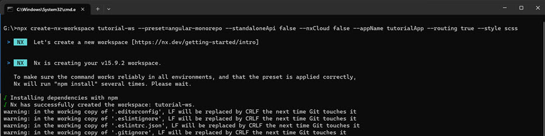
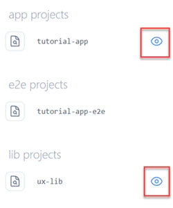
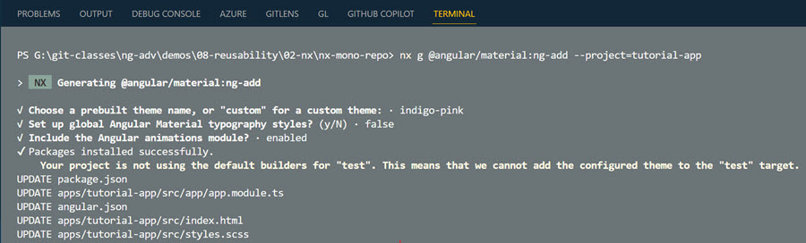
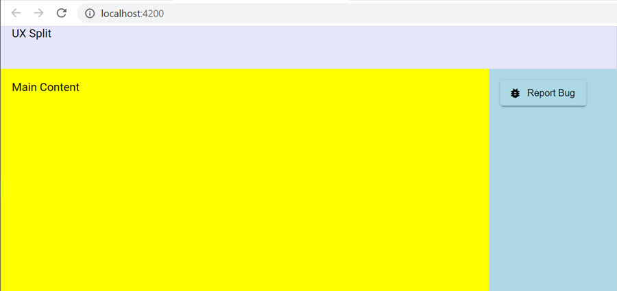

# Monorepos & nrwl nx

[Nx Home](https://nx.dev/angular)

[npx create-nx-workspace](https://nx.dev/nx/create-nx-workspace)

[Angular Nx Tutorial ](https://nx.dev/getting-started/angular-tutorial)

[Nx Console - VS Code Extension](https://marketplace.visualstudio.com/items?itemName=nrwl.angular-console)

[Nx Console for JetBrain](https://plugins.jetbrains.com/plugin/21060-nx-console)

## Getting Started

Install the [Nx Console - VS Code Extension](https://marketplace.visualstudio.com/items?itemName=nrwl.angular-console). It provides a nice UI for the nx commands.

To spare yourself from executing `nx-cli` using `npx` you could also install nx-cli - optional:

```bash
npm i -g create-nx-workspace
npm i -g nx
```

Create a workspace tutorial-app-ws using the Angular preset:

```bash
npx create-nx-workspace nx-mono-repo --preset=angular-monorepo --standaloneApi false --nxCloud false --appName tutorial-app --routing true --style scss
```



Update `apps/tutorial-app/src/app/app.component.html`:

```html
<div>
  <h3>First Nx Monorepo App</h3>
</div>
```

Build & run the app `tutorial-app`:

```bash
nx build --project tutorial-app
nx build tutorial-app
nx serve --project tutorial-app -o
nx serve tutorial-app -o
```

> Note: Keep the tutorital-app running in the background, just like you would do when using Angular CLI.

Test the app using Jest (default)

```bash
nx test tutorial-app
```

Update the `apps/tutorial-app/src/appapp.component.spec.ts` to allow the test to pass and re-run the test:

```typescript
it('should render title', () => {
  const fixture = TestBed.createComponent(AppComponent);
  fixture.detectChanges();
  const compiled = fixture.nativeElement as HTMLElement;
  expect(compiled.querySelector('h3')?.textContent).toContain(
    'First Nx Monorepo App'
  );
});
```

## Using libraries

Add a library project from the root of the nx workspace:

```bash
nx g @nrwl/angular:lib ux-lib --style scss
```

Show a project graph in from separate terminal and keep it open:

```bash
npx nx graph --watch
```

Check the tutorial-app and ux-lib project in the graph.



At the moment the graph is empty, even if you select the `tutorial-app` and `ux-helpers` lib. In the next setep we will add the content from `Module 02 - Components` to the library and the use it in the app. Navigate to app/shared/ux-lib and examine the split component. 

Next we will create a component in the nx-mono-repo:

```bash
nx g @nrwl/angular:component ux-split --project ux-lib --export --selector ux-split --style scss
```

Notice that Nx registeres the component in the `ux-lib.module.ts` and exports it in the index.ts. You can now copy the content of `Module 02 - Components` from `ux-split.component.ts` and `ux-split.component.html` and `*.scss` files. 

>Note: You will have to replace the variables in the scss files with concrete values. In a real project you would provides an *scss file with default values for the variables.

Update `ux-split.component.scss`.:

```css
.container {
  display: grid;
  grid-template-columns: auto 240px;
  grid-template-rows: 60px auto;
  grid-template-areas:
    "title title"
    "main sidebar";
  gap: 0.5rem;
  min-height: 300px;
  border: 1px solid lightblue;
}

.split-title{
  grid-area: title;
  background-color: lightblue;
  color: black;
  font-weight: bold;
  padding: 10px;
}

.split-main {
  grid-area: main;
  padding: 10px;
}

.split-sidebar {
  grid-area: sidebar;
  padding: 10px;
  background-color: lightgrey;
}
```

Update `ux-split.component.html`:

```html
<div class="container">
  <div class="split-title">
    <div>
        <ng-content select=".title"></ng-content>
    </div>
  </div>
  <div class="split-main">
    <ng-content select=".main"></ng-content>
  </div>
  <div class="split-sidebar">
    <ng-content select=".sidebar"></ng-content>
  </div>
</div>
```

Use the app.component.ts in the main app. In app.module.ts import the `UxLibModule` and notice how the dependency graph is updated:

```typescript
@NgModule({
  declarations: [AppComponent, NxWelcomeComponent],
  imports: [
    BrowserModule,
    RouterModule.forRoot(appRoutes, { initialNavigation: 'enabledBlocking' }),
    UxLibModule
  ],
  providers: [],
  bootstrap: [AppComponent],
})
export class AppModule {}
```

In app.component.html delete the default content and use the component:

```html
<div>
  <h3>First Nx Monorepo App</h3>
</div>
<ux-split>
  <div class="title">The Split</div>
  <div class="main">I don't like the green watermelons</div>
  <div class="sidebar">
    
  </div>
</ux-split>
```

To create the buttons execute:

```typescript
nx g @nrwl/angular:component ux-button --project ux-lib --export --selector ux-button --style scss
```

Add Angular Material to the workspace to use it in the `ux-lib` project because it is a dependency of the `ux-button` component:

```bash
npm i -S @angular/material @angular/cdk
```

You now can update the imports in the ux-lib.module.ts and implement the ux-button. Again you can take the code from `Module 02 - Components` and copy it to the `ux-button.component.ts` as a reference.

```typescript
@NgModule({
  imports: [CommonModule, MatIconModule, MatButtonModule],
  declarations: [UxSplitComponent, UxButtonComponent],
  exports: [UxSplitComponent, UxButtonComponent],
})
export class UxLibModule { }
```

Add Material to tutorial-app. Select a theme of your choice, enable typography and animations:


```bash
nx g @angular/material:ng-add --project=tutorial-app
```



Implement an reusable Button:

```bash
nx g @nrwl/angular:component uxButton --project ux-controls --export 
```

Update ux-button.component.ts & ux-button.component.html:

```typescript
@Component({
  selector: 'ux-button',
  templateUrl: './ux-button.component.html',
  styleUrls: ['./ux-button.component.scss'],
})
export class UxButtonComponent {
  @Input() disabled = false;
  @Input() label = '';
  @Input() icon = '';
  @Output() onClicked = new EventEmitter<string>();

  buttonClicked() {
    this.onClicked.emit("you clicked the button");
  }
}
```

```html
<button mat-raised-button (click)="buttonClicked()" [disabled]="disabled">
  <mat-icon>{{ icon }}</mat-icon>
  <span>{{ label }}</span>
</button>
```

Use the Button in the `tutorial-app-project` and add it to `app.component.html` and `app.component.ts`:

```html
<div class="sidebar">
  <ux-button
      [icon]="'keyboard_arrow_right'"
      [label]="'Go Back'">
      [disabled]="true"
    </ux-button>
    <ux-button
      [label]="'Bearbeiten'"
      [icon]="'edit'"
      (onClicked)="handleClick($event)"
    ></ux-button>
</div>
```

```typescript
import { Component } from '@angular/core';

@Component({
  selector: 'angular-repo-root',
  templateUrl: './app.component.html',
  styleUrls: ['./app.component.scss'],
})
export class AppComponent {
  title = 'tutorial-app';

  handleClick(evt: any) {
    console.log('msg from the button', evt);
  }
}
```

Your project should look like this:



>Note: If you want you can also at the formatting directives to ux-lib and test them in the app.

## Second app and dependency graph

Add a second app used for dependency graph later on:

```bash
nx generate @nrwl/angular:app ng-otherapp --routing --style=scss
```

>Note: Choose to use a standalone component and delete app.component.html

Import the `UxLibModule` in the standalone component:


```typescript
@Component({
  selector: 'ux-button',
  templateUrl: './ux-button.component.html',
  styleUrls: ['./ux-button.component.scss'],
})
export class UxButtonComponent {
  @Input() disabled = false;
  @Input() label = '';
  @Input() icon = '';
  @Output() onClicked = new EventEmitter<string>();

  buttonClicked() {
    this.onClicked.emit("you clicked the button");
  }
}
```

Check the dependency graph:

```bash
nx dep-graph
```

You should see something similar:


