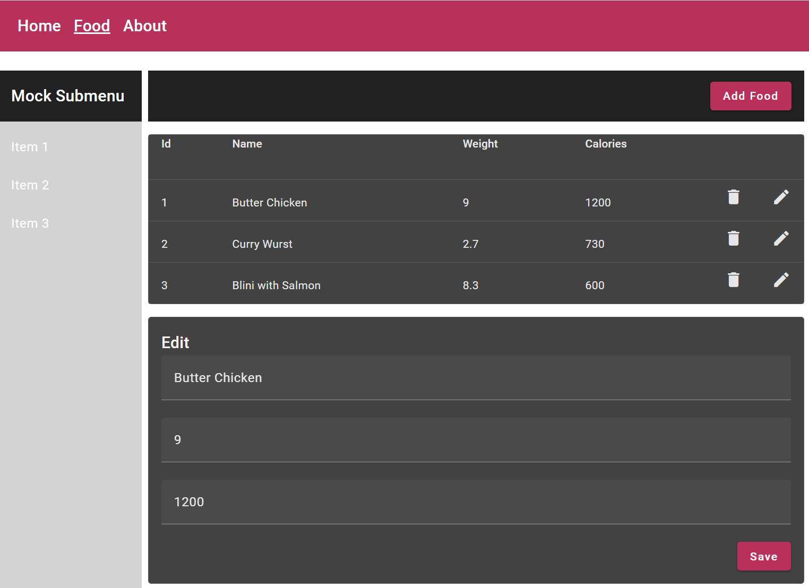

# Food App Project - Reactive Forms

-   Refactor `food-edit.component` to be implemented as a Reactive Form using FormBuilder.
-   Implement Validation for the name filed to be required with min lenght of 3 and the price filed to be positive

    

## Guide

-   Add the following db.json to the root of the project:

```json
{
    "food": [
        {
            "id": 1,
            "name": "Butter Chicken",
            "price": 9,
            "calories": 1200
        },
        {
            "id": 2,
            "name": "Curry Wurst",
            "price": 2.7,
            "calories": 730
        },
        {
            "id": 3,
            "name": "Wiener Schnitzel",
            "price": 8.3,
            "calories": 600
        }
    ]
}
```

-   Start the json-server with `json-server --watch db.json`

-   Add the following property to environment.ts:

```typescript
 api: "http://localhost:3000/",
```

-   Update the food.service.ts to use the api property from environment.ts

```typescript
@Injectable({
    providedIn: 'root',
})
export class FoodService {
    private url = `${environment.api}food`;

    constructor(private httpClient: HttpClient) {}

    getFood() {
        return this.httpClient.get<FoodItem[]>(this.url);
    }

    addFood(food: FoodItem) {
        return this.httpClient.post<FoodItem>(this.url, food);
    }

    updateFood(food: FoodItem) {
        return this.httpClient.put<FoodItem>(`${this.url}/${food.id}`, food);
    }

    deleteFood(id: number) {
        return this.httpClient.delete<FoodItem>(`${this.url}/${id}`);
    }
}
```

-   Add ReactiveFormsModule to app.module.ts

-   Inject FormBuilder to the constructor of food-edit.component.ts and initalize the foodForm FormGroup. Add a minLength validator to the name field and a min validator to the price field.

-   Initialize @Input() food with a new FoodItem() in food-edit.component.ts

-   Add a readonly form field for the id in food-edit.component.html

-   Replace the ngModel bindings with formControlName bindings in food-edit.component.html

-   Add a from tag below the mat-card-content tag in food-edit.component.html and attach a

-   Add mat-error elements to display validation errors in food-edit.component.html

-   Add the following ngOnChanges method to food-edit.component.ts

    ```typescript
    ngOnChanges(changes: SimpleChanges) {
        if (changes.food) {
        this.foodForm.patchValue(changes.food.currentValue);
        }
    }
    ```

-   Implement the onSubmit method in food-edit.component.ts

    ```typescript
    saveForm() {
        console.log('food to save', this.foodForm.value);
        this.saveFood.emit(this.foodForm.value);
    }
    ```

- In time permits you can complete the saving and updating of the food items.