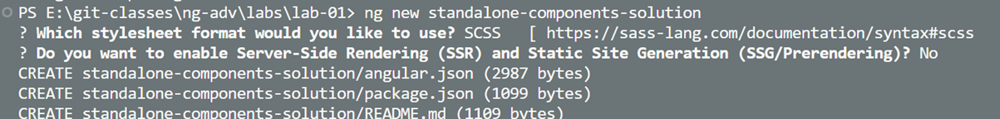
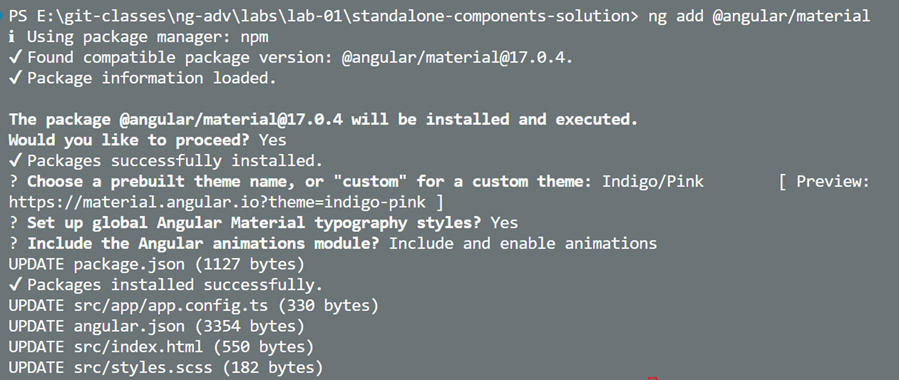

# Food App - Standalone Components

In this lab we will create a new Angular 17 project and we will create a navbar component and a sidebar component. We will use Angular Material for the navbar. We will also use json-server to create a fake backend. We will use the standalone configuration for the project.

## Guide

-   Install json-server:

    ```bash
    npm i -g json-server
    ```

-   Create a new project, use scss and do not use server side rendering

    

    > Note: You could skip answering the questions by using the following command:

    ```bash
    ng new standalone-component-solution --routing --style=scss --ssr=false
    ```

-   Add Angular Material to the project, chose a theme:

    ```bash
    ng add @angular/material
    ```

        

-   Add the environment configuration to the project:

    ```bash
    ng g environments
    ```

-   Modify the environment.development.ts file to reflect the base url of `json-server`:

    ```bash
    export const environment = {
        api: 'http://localhost:3000',
    };
    ```

-   Create a db.json file in the root folder:

    ```bash
    {
        "top-links": [
            {
                "title": "Home",
                "url": ""
            },
            {
                "title": "About",
                "url": "/about"
            },
            {
                "title": "Food",
                "url": "/food"
            }
        ]
    }
    ```

-   Run json-server:

    ```bash
    json-server --watch db.json
    ```    

-   Go to `src/main.ts` and `src/app` and notice the standalone configuration, especially `app.config.ts` and `app.routes.ts`. Examine this files. Also notice tha `app.module.ts` is not present.

-   Create a navbar component in the shared folder. Notice that with a project that was create with Angular 17 all components are created as standalone components by default.

    ```bash
    ng g c shared/navbar
    ```

-   Repeat this step to create a sidebar component in the shared folder.

    ```bash
    ng g c shared/sidebar
    ```

-   Create a food component in the food folder and a sidebar component in the shared folder.

    ```bash
    ng g c food/food
    ```

-   Repeat this steps to create a home component and an about component in the root folder.    


-   Import the NavBar and Sidebar components to the app.component.ts file. Also add the imports for `RouterOutlet`:

    ```typescript
    @Component({
        selector: 'app-root',
        standalone: true,
        imports: [RouterOutlet, NavbarComponent, SidebarComponent],
        templateUrl: './app.component.html',
        styleUrl: './app.component.scss'
    })
    ```

-   Replace the html in app.component.html with the following:

    ```html
    <div>
        <app-navbar></app-navbar>
    </div>
    <div class="mainRow">
        <div class="sideBar">
            <app-sidebar></app-sidebar>
        </div>
        <div class="main">
            <router-outlet></router-outlet>
        </div>
    </div>
    ```

-   Add the following to the app.component.scss file:

    ```scss
    .sideBar {
        background-color: lightgrey;
        width: 180px;
    }

    .main {
        min-width: 80vw;
        flex-grow: 1;
        margin: 0 2rem;
    }

    .mainRow {
        display: flex;
        flex-direction: row;
        width: 100%;
        height: 90vh;
    }
    ```

-   Add a MatToolbarModule and a MatListModule to sidebar.component.ts:

    ```typescript
    @Component({
        selector: 'app-sidebar',
        standalone: true,
        imports: [MatToolbarModule, MatListModule],
        templateUrl: './sidebar.component.html',
        styleUrl: './sidebar.component.scss'
    })
    export class SidebarComponent {}
    ```

-   Add the MatToolbar and MatList to the sidebar.component.html. Add the imports for MatToolbarModule and MatListModule yourself:

    ```html
    <mat-toolbar> Mock Submenu </mat-toolbar>

    <mat-list role="list" color="accent">
        <mat-list-item role="listitem">Item 1</mat-list-item>
        <mat-list-item role="listitem">Item 2</mat-list-item>
        <mat-list-item role="listitem">Item 3</mat-list-item>
    </mat-list>
    ```

-   Run ng s -o to check the result. At this point you should have a navbar and a sidebar in the app component but no content in the main section. Also they do not look very nice.

-   In the `shared/navbar` folder create a `nav-item.model.ts`:

    ```bash
    export class NavItem {
        title = ''
        url = ''
    }
    ```

-   In the `shared/navbar` folder create a `navbar.service.ts`:

    ```bash
    @Injectable({
        providedIn: 'root'
    })
    export class NavbarService {
        http = inject(HttpClient);

        getTopItems() {
            return this.http.get<NavItem[]>(`${environment.api}/top-links`);
            }
    }
    ```

-   Inject the `NavbarService` in the `navbar.component.ts`:

    ```bash
    @Component({
        selector: 'app-navbar',
        standalone: true,
        imports: [AsyncPipe, RouterLink, MatToolbarModule],
        templateUrl: './navbar.component.html',
        styleUrl: './navbar.component.scss'
    })
    export class NavbarComponent {
        ns = inject(NavbarService);
        items = this.ns.getTopItems();
    }
    ```

-   Modify the `navbar.component.html`:

    ```bash
    <mat-toolbar color="primary">
        <mat-toolbar-row>
            @for (item of items | async; track item) {
            <div [routerLink]="[item.url]">
                {{ item.title }}
            </div>
            }
        </mat-toolbar-row>
    </mat-toolbar>
    ```

-   Add the following styles to the `navbar.component.scss`:

    ```bash
    mat-toolbar {
        margin-bottom: 0.8rem;
    }

    mat-toolbar-row {
        div {
            margin: 0.5rem;
            cursor: pointer;
        }
    }
    ```

-   Run ng s -o to check the result. Open the F12 Dev Tools to check the error. You will notice that there is no provider for the HttpClient.

-   Update the route configuration in `app.routes.ts`:

    ```bash
    export const routes: Routes = [
        { path: "", component: HomeComponent },
        { path: "food", component: FoodComponent },
        { path: "about", component: AboutComponent }
    ];
    ```

-   Open `app.config.ts` and add the `provideHttpClient()` to the providers array. Also add the `provideRouter(routes)` and `provideAnimations()`:

    ```bash
    export const appConfig: ApplicationConfig = {
        providers: [
            provideHttpClient(),
            provideRouter(routes),
            provideAnimations()
        ]
    };
    ```

- Just for your understanding review that `appConfig` is used in `main.ts`:

    ```typescript
    bootstrapApplication(AppComponent, appConfig)
    .catch((err) => console.error(err));
    ```