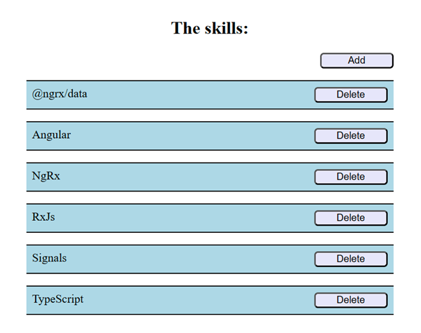
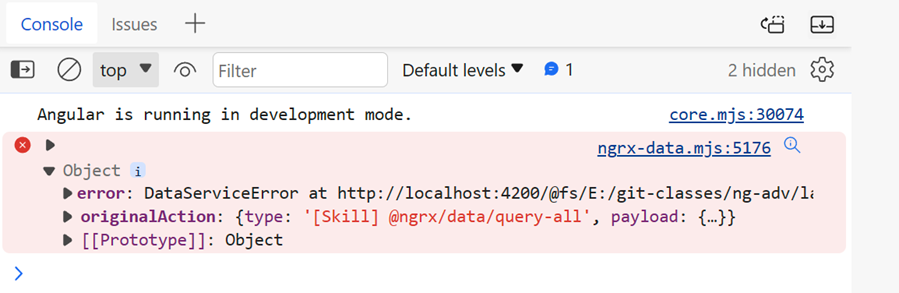

# NgRx Data

## Scaffold and Preparation

- Create project:

  ```bash
  ng new ngrx-data-standalone --routing=false --style=scss --ssr=false
  ```

- Copy `db.json` to the root folder. Make sure json-server is installed globally:

  ```bash
  npm i -g json-server
  ```

- Run json-server in a separate terminal:

  ```bash
  json-server db.json --watch
  ```    

- Add the environments configuration:

  ```bash
  ng g environments
  ```

- Add the default url to environment.ts and environment.development.ts:

  ```typescript
  export const environment = {
    url: 'http://localhost:3000',
  };
  ```  

- Add support for `HttpClient` to the providers array of `app.config.ts`:

  ```typescript
  provideHttpClient(),
  ```

- Add a `skills/skills.component.ts` using the Angular CLI and add it to app.component.html. Add the required imports and styles on your own:

```html
<div class="container">
  <h2>The skills:</h2>
  <app-skills></app-skills>
</div>
```

- Add the base NgRx modules:

```bash
npm i -S @ngrx/store @ngrx/entity @ngrx/effects
npm i -D @ngrx/store-devtools
```

- Add the basic NgRx setup to to the providers array of `app.config.ts`. Add missing imports. The import for the NgRx Dev tools will be `import { provideStoreDevtools } from '@ngrx/store-devtools';`:

  ```typescript
  provideStore(),
  provideEffects(),
  provideStoreDevtools(),
  ```

  >Note: Make sure that you have the [Redux Dev Tools](https://chromewebstore.google.com/detail/redux-devtools/lmhkpmbekcpmknklioeibfkpmmfibljd?pli=1) installed in your browser. 

- Commit your changes to your local git repository:

  ```bash
  git add .
  git commit -m "Basic scaffold"
  ```

- Add @ngrx/data:

  ```bash
  ng add @ngrx/data
  ```

- Examine the changes made by the schematic in `app.config.ts`. Move `entity-metadata.ts` to the `skills` folder. 


- Add `skills/skills.model.ts`:

```typescript
export interface Skill {
  id: number;
  name: string;
  completed: boolean;
}
```

- Add a sort function to `entity-metadata.ts`:

  ```typescript
  export function sortByName(a: Skill, b: Skill): number {
    let comp = a.name.localeCompare(b.name);
    return comp;
  }
  ```

- Define the skill entity metadata in `entity-metadata.ts`:

  ```typescript
  export const entityMetadata: EntityMetadataMap = {
    Skill: {
      sortComparer: sortByName,
    },
  };
  ```

Create the EntityDataService in `skills/skills-entity.service.ts`. If you do not want to override the methods, that is all you will have to do in order to load entity data.

  ```typescript
  @Injectable({
    providedIn: 'root',
  })
  export class SkillsEntityService extends EntityCollectionServiceBase<Skill> {
    constructor(factory: EntityCollectionServiceElementsFactory) {
      super('Skill', factory);
    }
  }
  ```

- Try to implement the User Interface:



- Add the following html to `skills/skills.component.html`:

  ```html
  <div class="container">
    <div class="right">
      <button (click)="addSkill()">Add</button>
    </div>
    @for (sk of skills$ | async; track sk) {
    <div>
      <div class="row">
        <div class="label">{{ sk.name }}</div>
        <button (click)="deleteSkill(sk)">Delete</button>
      </div>
    </div>
    }
  </div>
  ```

Add a `skills/skills.component.ts` using the Angular CLI and add the following code to it:

```typescript
export class SkillsComponent {
  entityService = inject(SkillsEntityService);
  skills$: Observable<Skill[]>;
  skillsService: EntityCollectionService<Skill>;

  constructor() {
    this.skillsService = this.entityService;
    this.skills$ = this.skillsService.entities$;
  }

  ngOnInit(): void {
    this.skillsService.getAll();
  }

  addSkill() {
    this.skillsService.add({ id: 0, name: '@ngrx/data', completed: false });
  }

  deleteSkill(item: Skill) {
    this.skillsService.delete(item);
  }
}
```

- Run the application and check the console for errors. You should see the following error:

  

- @ngrx/data listens on `http://localhost:4200/api/{entity}` by default. To override this, we will implement a `CustomUrlHttpGenerator`:

  ```typescript
  @Injectable()
  export class CustomUrlHttpGenerator extends DefaultHttpUrlGenerator {
    constructor(pluralizer: Pluralizer) {
      super(pluralizer);
    }

    protected override getResourceUrls(
      entityName: string,
      root: string,
      trailingSlashEndpoints?: boolean
    ): HttpResourceUrls {
      let resourceURLs = this.knownHttpResourceUrls[entityName];
      if (entityName == 'Skill') {
        resourceURLs = {
          collectionResourceUrl: `${environment.url}/skills/`,
          entityResourceUrl: `${environment.url}/skills/`,
        };
        this.registerHttpResourceUrls({ [entityName]: resourceURLs });
      }
      return resourceURLs;
    }
  }
  ```

- The custom URL generator needs to be registered in `app.module.ts`:

  ```typescript
  providers: [
    ...
    {
      provide: HttpUrlGenerator,
      useClass: CustomUrlHttpGenerator,
    },
  ],
  ```

- Run the application again. You can now test the application and see if it works as expected.