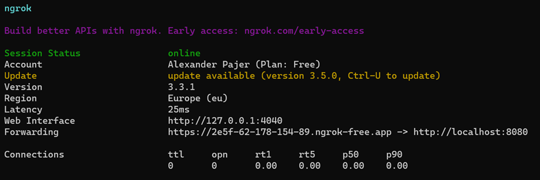

# Progressive Web Apps

In this lab we will create a simple PWA using Angular and .NET Core. We will use the `@angular/pwa` package to add PWA support to our Angular app. We will also use `ngrok` to serve our app over https and test the PWA functionality. Finally we will use `Docker` to containerize our .NET Core skills service and serve it from a container.

## Implementation

Allow Chrome to use self signed localhost certs:

```
chrome://flags/#allow-insecure-localhost
```

[ngrok](https://ngrok.com/) is a tool that provides an `https-secured tunnel` to `localhost` that enables testing your PWAs. Requires registration but is free.

After creating your free account copy ngrok.exe to a folder of your choice (`C:\Program Files\ngrok`) and set a path variable to it.

Next grab the auth token from your ngrok user info and add it to your machine config:

```
ngrok config add-authtoken <your-token>
```

A skills service container is available at DockerHub: 

```
docker pull arambazamba/skills-api
docker run -it --rm -p 5051:80 arambazamba/skills-api
```

Create a new Angular project and add PWA support:

```
ng new skills-pwa --routing --style=scss
cd skills-pwa
ng add @angular/pwa --project skills-pwa
```

Add environment config:

```
ng g environments --project skills-pwa
```

Make sure you adjust your `environment.ts` and `environment.development.ts` to match IP config of your dev machine

```
export const environment = {
    api: 'https://localhost:5051/api/'
};
```

Add `HttpClientModule` and `ReactiveFormsModule` to `app.module.ts`:

```typescript

>Note: PWA implementation code is skipped here. Copy `skills` and `hello` to your project and add them to `app.module.ts` and `app.component.ts`:

```html
<div class="card">
  <div class="container">
    <app-hello [greeting]="msgGreeting"></app-hello>
    <app-skills></app-skills>
  </div>
</div>
```

Test the app - see if it works

---

## Serving your app using ngrok & install the PWA

To serve the build you need an http-server. Use `angular-http-server` or `http-server`

```
npm install -g angular-http-server
ng build -c production
cd .\dist\skills-pwa\
angular-http-server
```

```
ngrok.exe http 8080
```

Open the Url provided by ngrok in your browser:



Now you can install the PWA:


Note that there is an update handler in app.component.ts:

```typescript
ngOnInit() {
  this.attachUpdateHandler();
}

private attachUpdateHandler() {
  if (this.swUpdate.isEnabled) {
    this.swUpdate.versionUpdates.subscribe(() => {
      if (confirm('New version available. Load New Version?')) {
        window.location.reload();
      }
    });
  }
}
```

Preloading / Fetching can be fine tuned in `ngsw-config.json`:

```json
"assetGroups": [
    {
      "name": "app",
      "installMode": "prefetch",
      "resources": {
        "files": [
          "/favicon.ico",
          "/index.html",
          "/manifest.webmanifest",
          "/*.css",
          "/*.js"
        ]
      }
    },
    {
      "name": "assets",
      "installMode": "lazy",
      "updateMode": "prefetch",
      "resources": {
        "files": [
          "/assets/**",
          "/*.(svg|cur|jpg|jpeg|png|apng|webp|avif|gif|otf|ttf|woff|woff2)"
        ]
      }
    }
  ]
```